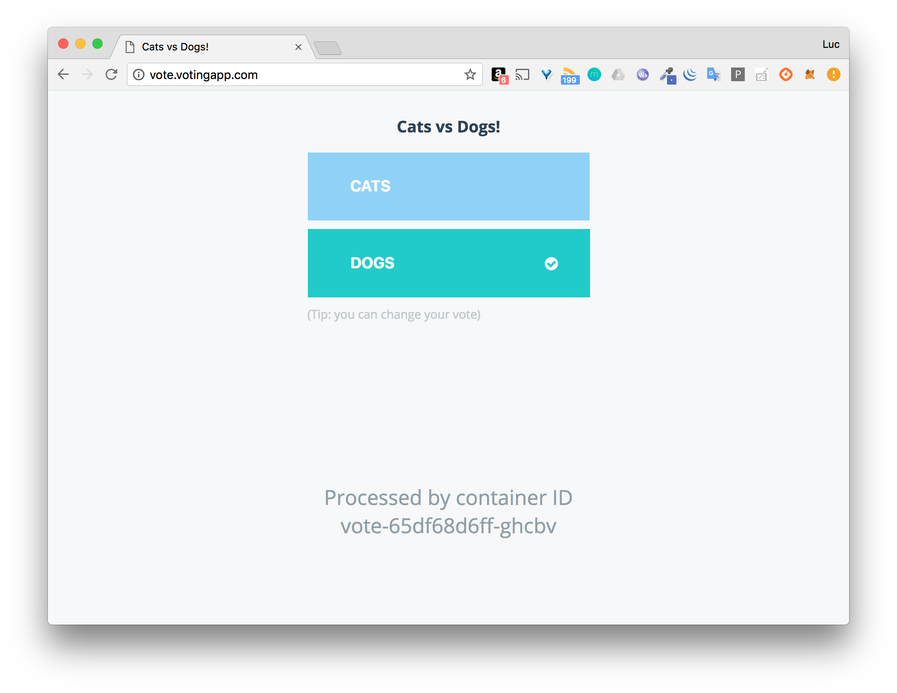

# Ressource Ingress pour le routage de la VotingApp

Dans cet exercice, vous allez créer une ressource *Ingress* et l'utiliser pour router les requêtes vers les interfaces de vote et de result de la VotingApp.

## 1. Installation d'un Ingress Controller

Un Ingress Controller est nécessaire afin de prendre en compte la ressource Ingress qui sera utilisée pour exposer les services à l'extérieur du cluster. C'est un reverse-proxy qui sera configuré à l'aide de ressources de type Ingress.

Dans cet exercice nous allons déployer un Ingress Controller basé sur Nginx mais il est possible d'utiliser un autre type d'Ingress Controller (*HAProxy*, *Traefik*, ...).

En utilisant la documentation officielle, installez le Ingress Controller qui correspond à votre environnement (https://kubernetes.github.io/ingress-nginx/deploy/)

En utilisant la commande suivante, attendez que les différents Pods soient correctement démarrés:

Note: attention cette commande ne vous rendra pas la main, vous pourrez la stopper dès que le Pod *ingress-nginx-controller-xxx* présentera *1/1* dans la colonne *READY* et *Running* dans la colonne *STATUS*:

```
$ kubectl get pods -n ingress-nginx -l app.kubernetes.io/name=ingress-nginx --watch
NAME                                        READY   STATUS      RESTARTS   AGE
ingress-nginx-admission-create-vd6sw        0/1     Completed   0          16s
ingress-nginx-admission-patch-4lw8p         0/1     Completed   2          15s
ingress-nginx-controller-66dc9984d8-5tnxt   0/1     Running     0          16s
ingress-nginx-controller-66dc9984d8-5tnxt   1/1     Running     0          27s
```

## 2. Lancement de la VotingApp

Déployez la Voting App avec la commande suivante, celle-ci fait référence à une URL pointant vers un fichier définissant l'ensemble des ressources de la Voting App

```
$ kubectl apply -f https://files.techwhale.io/voting.yaml
```

## 3. Ports des Service vote et result

La commande suivante liste les services existants:

```
$ kubectl get svc
NAME         TYPE        CLUSTER-IP       EXTERNAL-IP   PORT(S)          AGE
db           ClusterIP   10.245.16.246    <none>        5432/TCP         8s
kubernetes   ClusterIP   10.245.0.1       <none>        443/TCP          78s
redis        ClusterIP   10.245.187.226   <none>        6379/TCP         9s
result       NodePort    10.245.167.55    <none>        5001:31002/TCP   8s
vote         NodePort    10.245.230.88    <none>        5000:31001/TCP   9s
```

Nous pouvons voir que:
- le Service *vote* expose le port *5000* à l'intérieur du cluster, et le port *31001* à l'extérieur.
- le Service *result* expose le port *5001* à l'intérieur du cluster, et le port *31002* à l'extérieur.

## 4. Création de la ressource Ingress

:fire: depuis Kubernetes 1.19, l'apiVersion *networking.k8s.io/v1beta1* d'une ressource Ingress est dépréciée, il est préférable d'utiliser l'apiVersion *networking.k8s.io/v1* à la place. 

- Si vous utilisez un cluster dont la version est supérieure à 1.19:

créez un fichier *vote_ingress.yaml* contenant la spécification suivante:

```
apiVersion: networking.k8s.io/v1
kind: Ingress
metadata:
  name: voting-domain
spec:
  rules:
  - host: vote.votingapp.com
    http:
      paths:
      - path: /
        pathType: Prefix
        backend:
          service:
            name: vote
            port:
              number: 5000
  - host: result.votingapp.com
    http:
      paths:
      - path: /
        pathType: Prefix
        backend:
          service:
            name: result
            port:
              number: 5001
```

- Si vous utilisez un cluster dont la version est antérieure à 1.19

```
apiVersion: networking.k8s.io/v1beta1
kind: Ingress
metadata:
  name: voting-domain
spec:
  rules:
  - host: vote.votingapp.com
    http:
      paths:
      - path: /
        backend:
          serviceName: vote
          servicePort: 5000
  - host: result.votingapp.com
    http:
      paths:
      - path: /
        backend:
          serviceName: result
          servicePort: 5001


```

La spécification si dessus définit une ressource Ingress contenant 2 *rules*:
- la première spécifie que les requêtes qui arrivent sur *http://vote.votingapp.com* sont forwardées sur le port *5000* du Service nommé *vote*
- la seconde spécifie que les requêtes qui arrivent sur *http://result.votingapp.com* sont forwardées sur le port *5001* du Service nommé *result*

Créez cette ressource à l'aide de la commande suivante:

```
$ kubectl apply -f vote_ingress.yaml
```

## 6. Accès à l'application


Dans le fichier */etc/hosts* (si vous êtes sur Windows il s'agit du fichier *C:\Windows\System32\drivers\etc\hosts* qu'il faudra ouvrir avec les droits administrateur), définissez les résolutions DNS des sous-domaines *vote.votingapp.com* et *result.votingapp.com*. Ceux-ci devront pointer vers:

- l'adresse IP de Minikube (obtenue avec la commande ```minikube ip```) si vous utilisez cette solution
- l'adresse IP d'une des machines de votre cluster si le Ingress Controller est exposé via un Service de type NodePort
- l'adresse IP du LoadBalancer si le Ingress Controller est exposé via un Service de type LoadBalancer

Vous pouvez maintenant voter depuis l'interface de vote et visualiser les résultats sur l'interface de results.

- L'interface de vote est disponible:
  * sur http://vote.votingapp.com (port 80) si le Ingress Controller est exposé avec un service de type LoadBalancer
  * sur http://vote.votingapp.com:NODE-PORT, si le Ingress Controller est exposé avec un service de type *NodePort* (remplacez alors *NODE-PORT* par le port du service en question)



- L'interface de result est disponible:
  * sur http://result.votingapp.com (port 80) si le Ingress Controller est exposé avec un service de type LoadBalancer
  * sur http://result.votingapp.com:NODE-PORT si le Ingress Controller est exposé avec un service de type *NodePort* (remplacez alors *NODE-PORT* par le port du service en question)


## 7. Cleanup

- Supprimez la Voting App à l'aide de la commande suivante:

```
$ kubectl delete -f https://files.techwhale.io/voting.yaml
```

- Supprimez le Ingress Controller:

  * si vous êtes sur Minikube, utilisez la commande suivante:

```
$ minikube addons disable ingress
```

  * si vous n'êtes pas sur Minikube, supprimez le namespace *ingress-nginx* (et les ressources qui ont été créées en même temps) avec les commandes suivantes:

```
$ kubectl delete ns ingress-nginx
$ kubectl delete clusterrole ingress-nginx
$ kubectl delete clusterrolebinding ingress-nginx
$ kubectl delete -A ValidatingWebhookConfiguration ingress-nginx-admission
```

- Supprimez également la ressource Ingress

```
$ kubectl delete -f vote_ingress.yaml
```

### En résumé

Une ressource Ingress permet de diriger les flux HTTP vers différents services de l'application en fonction du nom de domaine utilisé. Il est aussi possible d'établir des règles beaucoup plus fines en se basant sur l'URL de la requête. On peut également se servir d'une ressource Ingress pour mettre en place une terminaison TLS.
